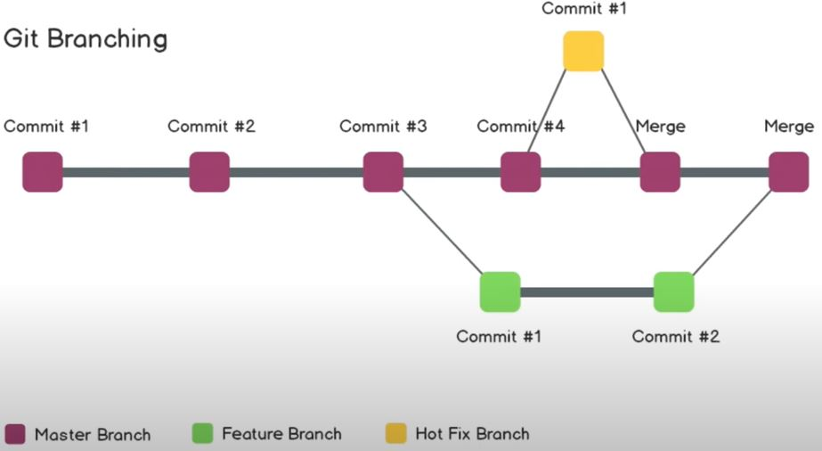

# **GitHub**
## **1.** What Git is?
Git is defined as a Version Control System
## **2.** What Version Control?
Is the way where Programmers track their code changes, documents and other collections of information
## **3.** What is a Git Repository?
Is the "folder" where our projects are contained
## **4.** Git Setup

    git config --global user.name "name"
    git config --global user.email "mail"
    git config color.ui auto (for ui color)
    git config -l (to view all config)
## **5.** Git Repo cloning

    git clone https://github.com/username/repo
## **6.** Tracking changes

    git status
## **7.** Adding files
"-A" parameter stands for All, we can specify single files "example.txt"

    git add -A
## **8.** Commiting changes
"-am" stands for all and comment, in the brackets we can add a comment

    git commit -am "comment"
## **9.** SSH keys
Generating a local key (default file: user/.ssh/id_rsa)

    ssh-keygen -t rsa -b 4096 -C "email@example.com"
We generate 2 keys, private one and public one, the public is needed by github repo settings
## **10.** Publishing the Repo changes on GitHub

    git push (origin master)
## **11.** Starting a repo locally

    git init
    *adding file, commiting, but we cannto push*
    *creating a repo on GitHub*
    git remote add origin *link for repo*
    git remote -v (shows any remote repos)
    git push (-u for setting default origin master)(origin master)
## **12.** Git branching
Master is our default branch

Check branches (we must push all almost one time)

    git branch
Creating new branch

    git checkout -b *branchname*
Changing branch

    git checkout *branch name*
View the difference between branches 

    git diff *name of branch*
Push changes on the new branch

    git push --set-upstream (-u) origin branch1
I can delete branches

    git checkout -d *branchname*
Undo changes (1 commit back)

    git reset HEAD~1
We can see the changes log

    git log

